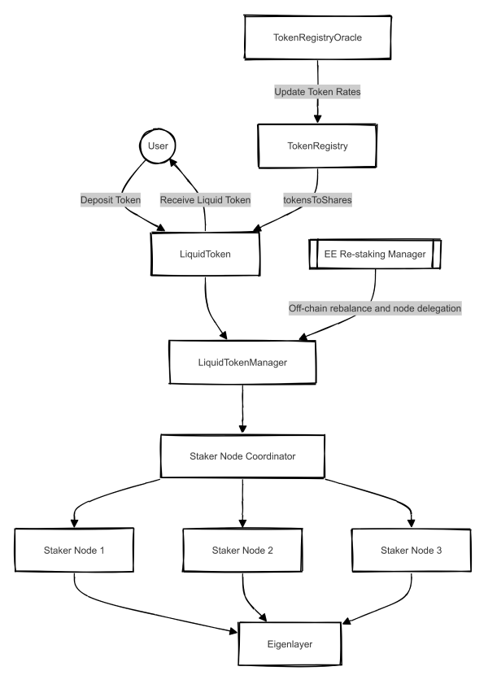

# LiquidAvsToken Documentation

This repo contains the LiquidAvsToken contract and its documentation.

## Contents

- Core Components
  - [LiquidToken](#liquidtoken)
  - [LiquidTokenManager](#liquidtokenmanager)
  - [StakerNode](#stakernode)
  - [StakerNodeCoordinator](#stakernodecoordinator)
- User Flows

## Core Components

### LiquidToken

The LiquidToken contract is a central component of the liquid staking system, implementing a tokenized representation of staked assets. It manages user deposits and withdrawals, minting shares to represent user stakes, and interacts with the TokenRegistry and LiquidTokenManager to handle asset management and user requests. This contract enables users to participate in staking while maintaining liquidity, as they can transfer or trade their liquid token shares. It also implements important security features such as access control, pausability, and reentrancy protection.

**User interaction**: Users deposit supported assets into the LiquidToken contract to receive liquid staking tokens, which can be later withdrawn or traded.

See full documentation [/core/LiquidToken.sol.md](./core/LiquidToken.sol.md).

### LiquidTokenManager

The LiquidTokenManager contract is the primary interface between the liquid staking system and the Eigenlayer protocol. It manages the staking of assets to Eigenlayer strategies through StakerNodes, coordinates asset allocation across nodes, and handles the mapping between assets and their corresponding Eigenlayer strategies. This contract plays a crucial role in optimizing asset distribution and ensuring efficient use of staked resources across the network of StakerNodes. It also provides functions for retrieving staked balances and updating strategy configurations.

See full documentation [/core/LiquidTokenManager.sol.md](./core/LiquidTokenManager.sol.md).

### StakerNode

The StakerNode contract serves as an individual staking node within the liquid staking ecosystem. It interacts directly with the Eigenlayer protocol to deposit assets, delegate staking operations, and manage staking rewards. Each StakerNode is responsible for a portion of the total staked assets and can be delegated to operators in the Eigenlayer system. This contract is designed to be upgradeable and is managed by the StakerNodeCoordinator, allowing for flexible asset management and delegation strategies.

See full documentation [/core/StakerNode.sol.md](./core/StakerNode.sol.md).

### StakerNodeCoordinator

The StakerNodeCoordinator contract is responsible for managing the creation, upgrading, and coordination of StakerNodes. It acts as a factory for creating new StakerNode instances and maintains control over their upgradability. This contract also manages access control for various roles within the system, such as node creation and delegation. By centralizing the management of StakerNodes, it provides a single point of control for the liquid staking system's node infrastructure, enabling efficient updates and management of the staking network.

See full documentation [/core/StakerNodeCoordinator.sol.md](./core/StakerNodeCoordinator.sol.md).

## User Flows

